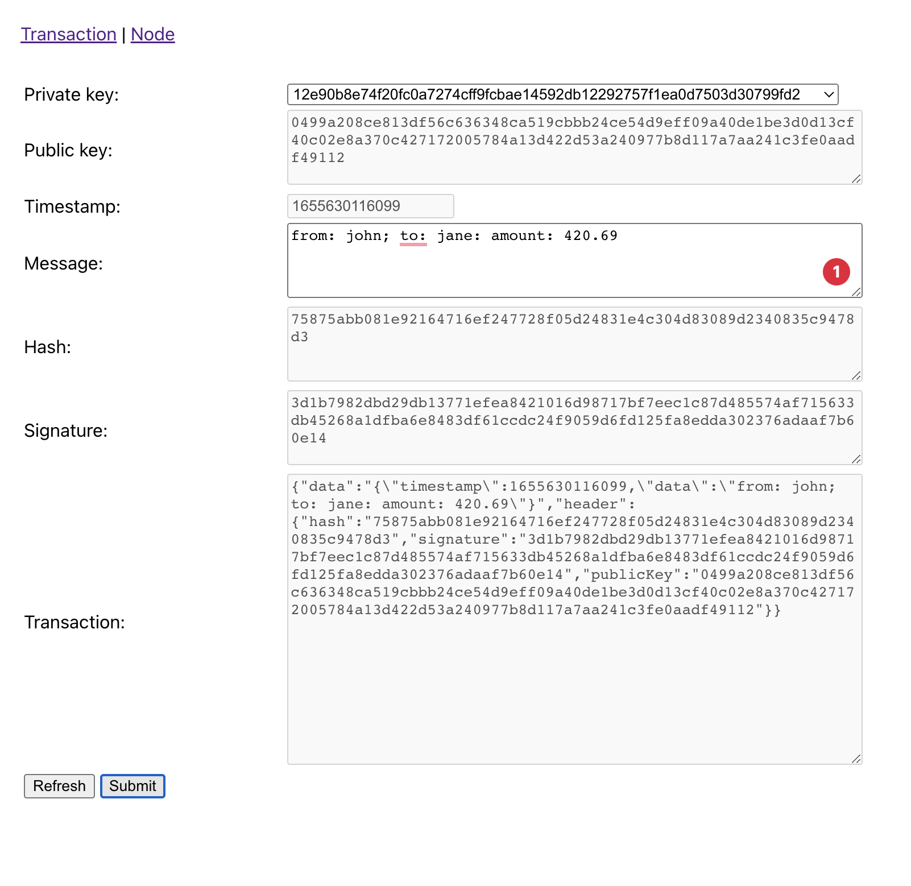
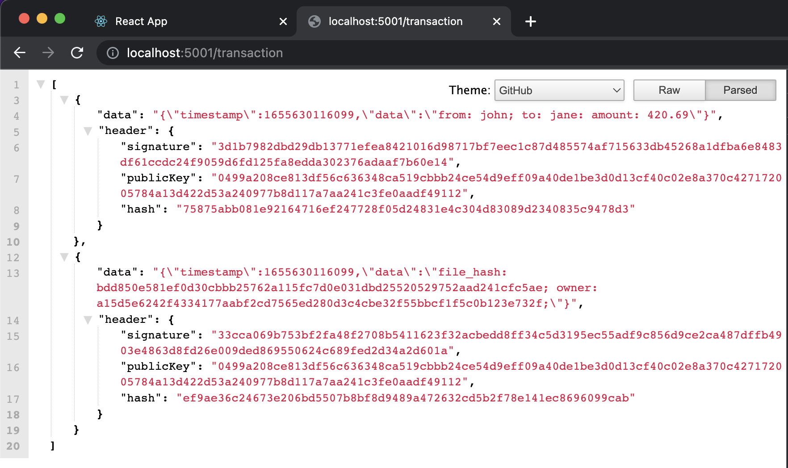
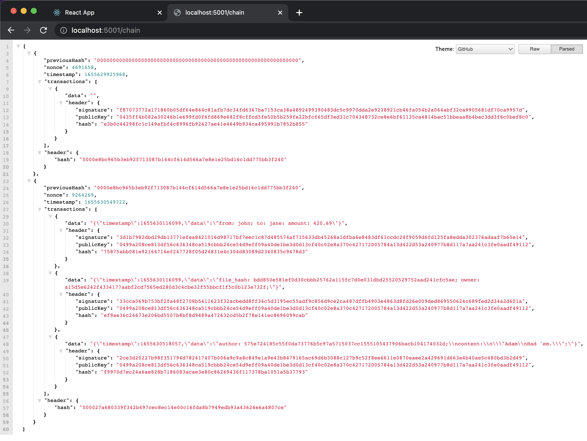
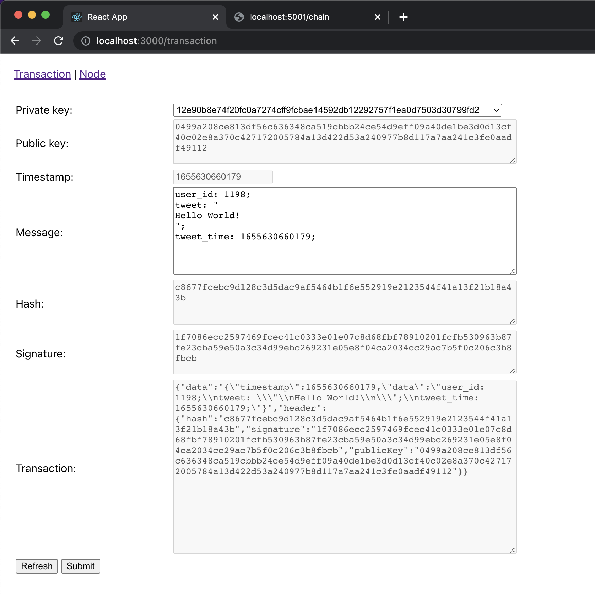
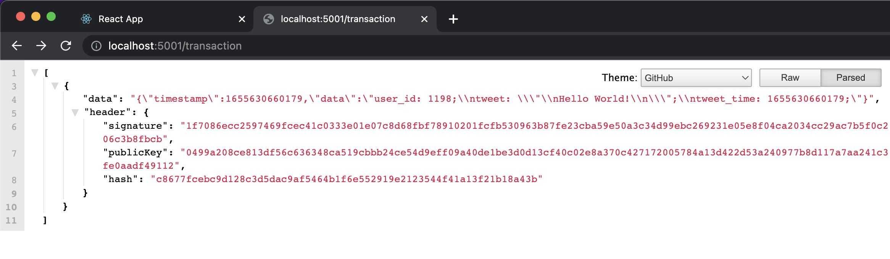

# SpongeJS Blockchain 🧱⛓

## Important Notes!
- This blockchain is intended to be a "networked blockchain" but for some technical reasons of how NodeJs (Express) behaves, this cannot be achieved, so it is better to assume that this is a "single-node blockchain"
- All data is stored in memory (no database)
- Uses HTTP protocol (for simplicity) for communicating nodes
- Use the ReactJS web app "reactjs-client" to test and create transactions
- Swagger API doc is at `<hostname>/doc`
- Block size is `3 transactions` by default
- Mining difficulty can be adjusted in Blockchain class `static #DIFFICULTY = '0000';`
- This is a general-purpose blockchain so you can store any form of data such as cryptocurrency, patents, transactions, records, etc.

## Capabilities
1. Private/Public key 🔐
1. Signing/verifying 📝
1. Create transaction 🔨
1. Validate transaction 📝
1. Transaction broadcasting 📜
1. Block mining 👨🏻‍🚒
1. Block broadcasting 🧱 (not fully working due to NodeJs behavior issue)
1. Join network 🗼
1. Network change broadcasting 📡

## Facts
1. Uses [SHA256](https://en.wikipedia.org/wiki/SHA-2) algorithm for hashing.
1. Uses [Elliptic Curve](https://en.wikipedia.org/wiki/Elliptic-curve_cryptography) cryptography for signing/verification (better than RSA)
1. Uses [secp256k1](https://en.bitcoin.it/wiki/Secp256k1) curve
1. Uses [crypto-js](https://www.npmjs.com/package/crypto-js) library
1. Uses [cryptocoinjs' secp256k1](https://www.npmjs.com/package/secp256k1) library

## Before running
Use recommended NodeJs version (see `.nvmrc` file)
```sh
$ nvm use
```

Install dependencies
```sh
$ npm install
```

## Run node
```sh
$ PORT=5001 npm run start:norealod
```

## Run node and join network
```sh
$ PORT=5002 SPNG_NETWORK=localhost:5001 npm run start:norealod
```

## Run client web app (client-reactjs)
```sh
$ REACT_APP_NODE_ADDRESS=localhost:5001 npm run
```
Note: `REACT_APP_NODE_ADDRESS` is the blockchain node that you intended to connect. For more info, check the `api.ts`;

## Dev
### Recreate swagger doc
1. Run
    ```sh
    $ npm run gdoc
    ```

## Screens






